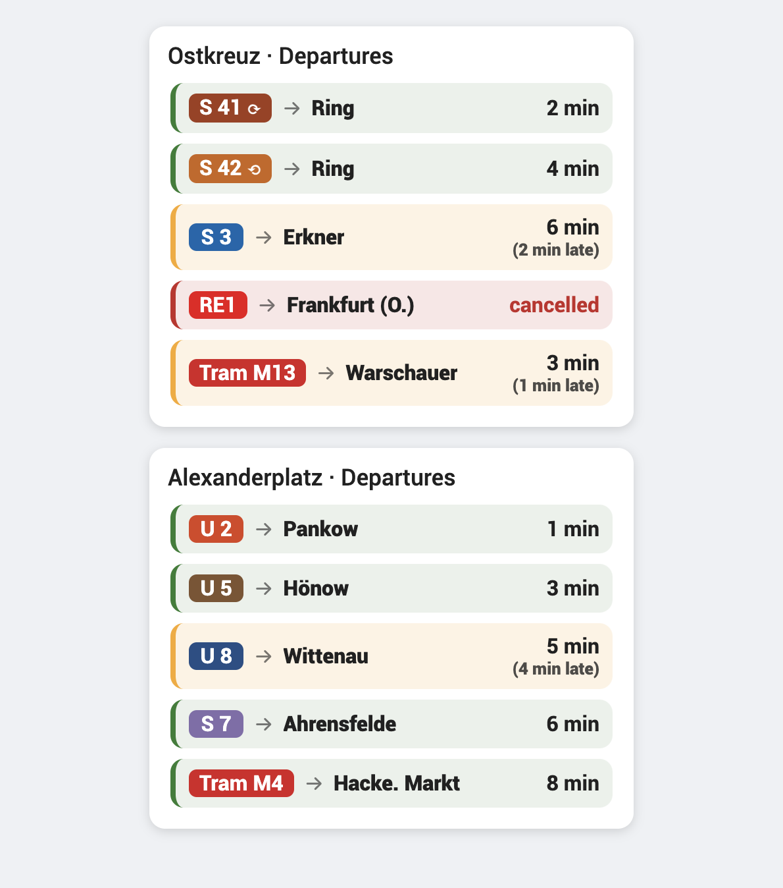

# Catchable

[](https://github.com/hacs/integration)
[](LICENSE)

**A real-time public-transport departure board for Home Assistant that only shows the departures you can actually *catch*.**

Catchable reads a live [GTFS-Realtime](https://gtfs.org/realtime/) feed and turns it into a clean, self-describing departure (or arrival) board — complete with live delays, cancellations, and a bundled Lovelace card. It ships with the **VBB (Berlin & Brandenburg)** stop index for quick setup — no API key and no third-party proxy required. Realtime data is always fetched live; availability depends on the VBB GTFS-RT feed.

The name says it all: tell Catchable how long you need to walk to the stop, and it hides anything that leaves too soon to reach. What's left is what you can still catch.

---

## Why Catchable?

Most Home Assistant transit integrations lean on a community REST proxy (`*.transport.rest`) that can rate-limit or disappear. Catchable talks **directly to the official GTFS-RT feed** and bundles the station index locally (used only when you add a board), so setup is just *pick a city → pick a stop*. No stop IDs to hunt down, no keys to register, no third-party proxy rate limits.

Under the hood it's a **generic GTFS-RT adapter**: VBB is the first bundled source, and new regions are just a feed URL plus a small lookup folder.

## Features

- 🚉 **Live departures *and* arrivals** — pick one direction per board; it's reflected in the entity name and card title.
- 🏙️ **Friendly setup** — searchable *city* picker narrows a searchable *station* picker. The stop ID is resolved in the background; you never see it.
- 🚶 **"Catchable" walk-time filter** — set how long it takes to reach the stop; departures sooner than that are hidden, so the board only shows what you can make.
- 🗺️ **Bundled VBB stop index** — the Berlin-Brandenburg stop index (~26,000 stations) ships with the integration and powers the setup picker, so there's no API key and no stop IDs to look up. Realtime availability depends on the VBB GTFS-RT feed.
- 🚇 **Transport-type filter** — U-Bahn, S-Bahn, train, tram, bus, ferry. The types serving your stop are auto-detected and preselected, with an "All" toggle.
- ⏱️ **Real-time delays & cancellations** *(where provided by the feed)* — colour-coded rows: green = on time, yellow = delayed (with a clear "*(3 min late)*" note), red = cancelled.
- 🎨 **Official Berlin line colours** — U-Bahn and S-Bahn line badges use the official BVG / S-Bahn Berlin colours (other modes fall back to a per-category colour). Toggle with `line_colors`.
- 🔄 **Ringbahn direction** — the S41 / S42 ring shows ⟳ (clockwise) / ⟲ (anti-clockwise) next to the line. Toggle with `ring_symbols`.
- 🎴 **Bundled Lovelace card** — auto-registered by the integration (no dashboard resource to add). Minutes are right-aligned and tabular; the stop name is the card title.
- 🌍 **Localized** — English (default) and German for the setup flow and the card.
- 💾 **Resilient** — caches the last good result and restores it across restarts, so a brief feed outage doesn't blank your board.

## Screenshots



*The bundled card with official Berlin line colours, the S41/S42 Ringbahn ⟳/⟲ symbols, live delays ("2 min late") and cancellations.*

## Installation

### HACS (recommended)

1. In HACS, open the three-dot menu → **Custom repositories**.
2. Add `https://github.com/borisvonmartens/catchable` with category **Integration**.
3. Search for **Catchable** and install it.
4. Restart Home Assistant.

### Manual

1. Copy the `custom_components/catchable` folder into your Home Assistant `config/custom_components/` directory.
2. Restart Home Assistant.

> The Lovelace card is shipped inside the integration and registered automatically — there's no separate frontend resource to add.

## Setup

1. Go to **Settings → Devices & Services → Add Integration** and search for **Catchable**.
2. **Choose a city** — start typing to search (e.g. *Potsdam*, *Berlin*).
3. **Choose a station** — start typing the stop name; set your **walk time** (minutes to reach the stop) and how many **departures** to show.
4. **Choose what to show** — departures or arrivals, and which transport types (or leave *All transport types* on).

Each board becomes a sensor named like `Burgstraße Departures`. Add a second board for the opposite direction or a different filter.

## The Lovelace card

Add a card and choose **Catchable Departures**, or in YAML:

```yaml
type: custom:catchable-departures-card
entity: sensor.burgstrasse_departures
# title: optional — defaults to the entity's friendly name (the stop name)
# line_colors: true   # official Berlin U-/S-Bahn line colours (default: true)
# ring_symbols: true  # ⟳ / ⟲ for the S41 / S42 Ringbahn (default: true)
```

The card renders one row per service: line + destination on the left, minutes right-aligned on the right, with delay/cancellation colour coding.

### Card options

| Option | Default | Description |
|---|---|---|
| `entity` | — | A Catchable departure/arrival sensor (required) |
| `title` | entity friendly name | Card header override |
| `line_colors` | `true` | Colour line badges with official Berlin line colours |
| `ring_symbols` | `true` | Show ⟳ / ⟲ for the S41 / S42 Ringbahn |

## Sensor data

The sensor's state is the minutes until the next (non-cancelled) departure. Useful attributes:

| Attribute | Description |
|---|---|
| `departures` | List of upcoming services (`line`, `direction`, `departure_in_min`, `delay_min`, `cancelled`, `kind`) |
| `stop_name` / `stop_id` | The configured stop |
| `direction` | `departures` or `arrivals` |
| `walk_time_minutes` | Minimum minutes-to-departure shown |
| `transport_types` | Active type filter, or `all` |
| `stale` | `true` when showing cached data because the live feed was unreachable |
| `refreshed_at` | Timestamp of the last successful fetch |

## How it works

- Polls the source's GTFS-RT feed (default every 90 s) and parses `trip_update` entities off the event loop.
- Matches the configured station against platform-level GTFS-RT stop IDs, maps `route_id` → line + transport category, and keeps only events at least `walk_time` minutes out.
- Station and line names come from small bundled JSON lookups (`custom_components/catchable/sources/<region>/`); the city/station picker is served entirely from the bundled index, so adding a board needs no extra network calls. Realtime departures are always fetched live from the feed.

## Adding more regions

Catchable is provider-neutral. To add a region, drop a `sources/<key>/` folder with `routes.json` and `stops.json` (and optionally `stations_index.json` for the city/station picker), then register it in `const.py`'s `GTFS_RT_SOURCES` with the feed URL.

## Roadmap

- Additional bundled GTFS-RT sources (e.g. a nationwide German source).
- Optional periodic refresh of the offline station index.

## Credits

Built for Home Assistant. VBB realtime data © Verkehrsverbund Berlin-Brandenburg, provided as open GTFS-RT. "VBB" is a trademark of its respective owner; this project is independent and not affiliated with or endorsed by VBB.

## License

[MIT](LICENSE) © Boris von Martens
